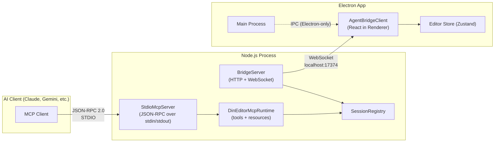

# DIN Studio — MCP Server Integration Plan

## Context

You already have a **complete, production-grade MCP server** in [din-studio/targets/mcp/](file:///Users/veacks/Sites/din-studio/targets/mcp). This plan analyzes what exists, identifies what's missing for your requested tools, and proposes the minimal changes needed.

> [!IMPORTANT]
> All MCP server code lives in the **din-studio** repository, NOT in **react-din**. The AGENTS.md rules for react-din state that DIN Studio-owned features live in the sibling `din-studio` repo. This plan targets `din-studio`.

---

## 1. Architecture (Already Implemented)

Your system is a **three-process pipeline**:



### Why WebSocket (not IPC or HTTP)?

| Mechanism | Bidirectional | Browser-compatible | Electron + Web | Frame control |
|-----------|:---:|:---:|:---:|:---:|
| IPC (Electron) | ✅ | ❌ | ❌ | ✅ |
| HTTP localhost | ❌ (polling) | ✅ | ✅ | ❌ |
| **WebSocket** | **✅** | **✅** | **✅** | **✅** |

**WebSocket is the correct choice** because:
- DIN Studio runs as **both an Electron app AND a web app** — IPC only works inside Electron
- The server needs **bidirectional real-time flow**: push requests to the browser (apply operations) AND receive state snapshots back
- **Loopback-only binding** (`127.0.0.1`) satisfies security constraints
- No need for a separate HTTP polling layer

> [!NOTE]
> For the 3 Electron-specific tools you requested (`focus_window`, `open_project`, `export_file`), the flow must go through the WebSocket bridge to the renderer, then via Electron IPC to the main process. This is necessary because the MCP server is a separate Node.js process — it cannot call Electron APIs directly.

---

## 2. What Already Exists

### Source files (all implemented and functional)

| File | Purpose |
|------|---------|
| [index.ts](file:///Users/veacks/Sites/din-studio/targets/mcp/src/index.ts) | Entry point — wires BridgeServer + Runtime + StdioServer |
| [stdioServer.ts](file:///Users/veacks/Sites/din-studio/targets/mcp/src/stdioServer.ts) | Custom JSON-RPC 2.0 STDIO transport |
| [runtime.ts](file:///Users/veacks/Sites/din-studio/targets/mcp/src/runtime.ts) | All 12 MCP tools + 5 resources |
| [bridgeServer.ts](file:///Users/veacks/Sites/din-studio/targets/mcp/src/bridgeServer.ts) | HTTP(S) + WebSocket server |
| [sessionRegistry.ts](file:///Users/veacks/Sites/din-studio/targets/mcp/src/sessionRegistry.ts) | Session lifecycle + request routing |
| [config.ts](file:///Users/veacks/Sites/din-studio/targets/mcp/src/config.ts) | Environment-based configuration |
| [logger.ts](file:///Users/veacks/Sites/din-studio/targets/mcp/src/logger.ts) | Structured stderr logging |
| [tls.ts](file:///Users/veacks/Sites/din-studio/targets/mcp/src/tls.ts) | Auto-generated local CA certs |

### Existing tools (12)

| Tool | Type |
|------|------|
| `editor_list_sessions` | Read |
| `editor_get_state` | Read |
| `editor_list_graphs` | Read |
| `editor_get_graph` | Read |
| `editor_preview_operations` | Read |
| `editor_apply_operations` | **Mutating** |
| `editor_import_patch` | **Mutating** |
| `editor_export_patch` | Read |
| `editor_validate_patch` | Read |
| `editor_generate_code` | Read |
| `editor_list_assets` | Read |
| `editor_ingest_asset_file` | **Mutating** |

### Bridge protocol ([protocol.ts](file:///Users/veacks/Sites/din-studio/bridge/protocol.ts))

Already supports envelope types: `session.hello`, `session.snapshot`, `graph.preview_operations`, `graph.apply_operations`, `patch.import`, `patch.export`, `codegen.generate`, `assets.list`, `assets.ingest_file`, `session.error`.

---

## 3. Proposed Changes — Adding Your 5 Requested Tools

### Mapping your request to the existing architecture

| Requested Tool | Status | Notes |
|----------------|--------|-------|
| `app_status` | 🆕 New | Returns app health/version info. Can be handled entirely server-side (no bridge needed) using existing registry data |
| `get_state` | ✅ Already exists | This is `editor_get_state`. Already returns the full session state snapshot |
| `focus_window` | 🆕 New | Requires a new bridge envelope type `app.focus_window` → renderer → Electron IPC to main process |
| `open_project` | 🆕 New | Requires a new bridge envelope type `app.open_project` → renderer → Electron IPC to main process |
| `export_file` | 🆕 New | Requires a new bridge envelope type `app.export_file` → renderer → Electron IPC to main process (save dialog + write) |

### 3.1 Files to modify

---

#### [MODIFY] [runtime.ts](file:///Users/veacks/Sites/din-studio/targets/mcp/src/runtime.ts)

Add 4 new tool definitions to `TOOL_DEFINITIONS` and their handlers in `callTool()`:

```typescript
// === app_status ===
// No bridge request needed — uses registry data directly
{
    name: 'editor_app_status',
    description: 'Return the health status, version, and connection count of the DIN Studio application.',
    inputSchema: {
        type: 'object',
        properties: {},
        additionalProperties: false,
    },
}

// === focus_window ===
{
    name: 'editor_focus_window',
    description: 'Bring the DIN Studio application window to the foreground.',
    inputSchema: {
        type: 'object',
        properties: {
            sessionId: { type: 'string' },
        },
        additionalProperties: false,
    },
}

// === open_project ===
{
    name: 'editor_open_project',
    description: 'Open a DIN Studio project from a local file path.',
    inputSchema: {
        type: 'object',
        properties: {
            sessionId: { type: 'string' },
            path: {
                type: 'string',
                description: 'Absolute path to the project file.',
            },
        },
        required: ['path'],
        additionalProperties: false,
    },
}

// === export_file ===
{
    name: 'editor_export_file',
    description: 'Export the current project or graph to a local file.',
    inputSchema: {
        type: 'object',
        properties: {
            sessionId: { type: 'string' },
            graphId: { type: 'string' },
            outputPath: {
                type: 'string',
                description: 'Absolute path where the file should be saved.',
            },
            format: {
                type: 'string',
                enum: ['patch.json', 'react'],
                description: 'Export format. Defaults to patch.json.',
            },
        },
        required: ['outputPath'],
        additionalProperties: false,
    },
}
```

---

#### [MODIFY] [protocol.ts](file:///Users/veacks/Sites/din-studio/bridge/protocol.ts)

Add 3 new envelope types for Electron-specific actions:

```typescript
// Add to BridgeEnvelope.type union:
| 'app.focus_window'
| 'app.open_project'
| 'app.export_file'

// Add request/response interfaces:
export interface BridgeFocusWindowRequest {}
export interface BridgeFocusWindowResponse { focused: boolean }

export interface BridgeOpenProjectRequest { path: string }
export interface BridgeOpenProjectResponse { opened: boolean; projectName?: string }

export interface BridgeExportFileRequest {
    graphId?: string;
    outputPath: string;
    format: 'patch.json' | 'react';
}
export interface BridgeExportFileResponse { written: boolean; outputPath: string; size: number }
```

---

#### [MODIFY] [AgentBridgeClient.tsx](file:///Users/veacks/Sites/din-studio/bridge/AgentBridgeClient.tsx)

Add handlers for the 3 new envelope types in the WebSocket message dispatcher. These handlers will call Electron IPC via the preload API:

```typescript
// In the message handler switch:
case 'app.focus_window':
    // Call window.electronAPI.focusWindow() via preload bridge
    break;
case 'app.open_project':
    // Call window.electronAPI.openProject(payload.path) via preload bridge
    break;
case 'app.export_file':
    // Call window.electronAPI.exportFile(payload) via preload bridge
    break;
```

---

#### [MODIFY] [preload.ts](file:///Users/veacks/Sites/din-studio/targets/app/preload.ts)

Expose 3 new IPC channels through `contextBridge`:

```typescript
focusWindow: () => ipcRenderer.invoke('mcp:focus-window'),
openProject: (path: string) => ipcRenderer.invoke('mcp:open-project', path),
exportFile: (opts: { outputPath: string; graphId?: string; format: string }) =>
    ipcRenderer.invoke('mcp:export-file', opts),
```

---

#### [MODIFY] [main.ts](file:///Users/veacks/Sites/din-studio/targets/app/main.ts)

Register 3 IPC handlers in the Electron main process:

```typescript
ipcMain.handle('mcp:focus-window', () => {
    const win = BrowserWindow.getAllWindows()[0];
    if (win) { win.show(); win.focus(); }
    return { focused: true };
});

ipcMain.handle('mcp:open-project', (_event, path: string) => {
    // Validate path, then load project
    return { opened: true, projectName: basename(path) };
});

ipcMain.handle('mcp:export-file', (_event, opts) => {
    // Write file to disk from main process
    return { written: true, outputPath: opts.outputPath, size: /* bytes */ };
});
```

---

## 4. Configuration & Launch

### Already working — no changes needed

**Build + run (dev mode):**
```bash
cd /Users/veacks/Sites/din-studio
npm run dev:mcp
```

**MCP client configuration (STDIO):**
```json
{
  "mcpServers": {
    "din-studio": {
      "command": "node",
      "args": [
        "--enable-source-maps",
        "/Users/veacks/Sites/din-studio/targets/mcp/dist/index.cjs",
        "--dev",
        "--bridge-protocol", "http",
        "--bridge-host", "localhost",
        "--bridge-port", "17374"
      ]
    }
  }
}
```

**Alternative with `npx tsx` (no build step):**
```json
{
  "mcpServers": {
    "din-studio": {
      "command": "npx",
      "args": [
        "tsx",
        "/Users/veacks/Sites/din-studio/targets/mcp/src/index.ts",
        "--dev",
        "--bridge-protocol", "http",
        "--bridge-host", "localhost",
        "--bridge-port", "17374"
      ]
    }
  }
}
```

---

## 5. Security Model (Already Enforced)

| Constraint | Implementation |
|-----------|----------------|
| Loopback only | `isLoopbackAddress()` check on every HTTP/WS request |
| Ephemeral token | Random UUID per server start, validated during `session.hello` |
| Read-only mode | `DIN_STUDIO_MCP_READ_ONLY=true` rejects all mutating tools |
| No shell execution | No `child_process.exec` on user input |
| Typed operations | Structural validation through `EditorOperation` union type |
| Path validation | `assertPatchFilePath()` restricts file access to `.json`/`.patch.json` |

> [!WARNING]
> The new `open_project` and `export_file` tools introduce file path parameters. We must validate these paths in the main process IPC handlers (allowlisted extensions, no path traversal outside workspace).

---

## 6. Project Structure (Current)

```
din-studio/
├── core/                          # Shared domain logic (isomorphic)
│   ├── types.ts                   # EditorSessionState, EditorOperation, etc.
│   ├── operations.ts              # applyEditorOperations()
│   └── ...
├── bridge/                        # Browser-side bridge client
│   ├── protocol.ts                # BridgeEnvelope, types
│   ├── AgentBridgeClient.tsx      # React WS client
│   ├── status.ts                  # McpBridgeStatus
│   └── McpStatusBadge.tsx         # Status indicator
├── targets/
│   ├── mcp/                       # ← THE MCP SERVER
│   │   ├── src/
│   │   │   ├── index.ts           # Entry point
│   │   │   ├── stdioServer.ts     # JSON-RPC 2.0 STDIO
│   │   │   ├── runtime.ts         # All tools & resources
│   │   │   ├── bridgeServer.ts    # HTTP + WebSocket
│   │   │   ├── sessionRegistry.ts # Session lifecycle
│   │   │   ├── config.ts          # Env config
│   │   │   ├── logger.ts          # Structured logging
│   │   │   └── tls.ts             # Local CA certs
│   │   ├── tests/
│   │   ├── tsconfig.json
│   │   ├── tsup.config.ts         # Build → dist/index.cjs
│   │   └── vitest.config.ts
│   ├── app/                       # Electron target
│   │   ├── main.ts                # Electron main process
│   │   ├── preload.ts             # contextBridge API
│   │   └── ...
│   └── web/                       # Web target (Vite)
├── scripts/
│   ├── run-mcp.mjs                # Build + run MCP server
│   └── dev-stack.mjs              # MCP + Vite dev together
└── package.json
```

---

## Open Questions

> [!IMPORTANT]
> **Q1**: `get_state` already exists as `editor_get_state`. Should I create an alias `app_status` that wraps the same data, or do you want `app_status` to return different/lighter information (just uptime, version, connection count — without the full graph state)?

> [!IMPORTANT]
> **Q2**: For `focus_window` — do you want this to work only when DIN Studio runs as Electron, or should the web target also have a fallback (e.g., `window.focus()`)?

> [!IMPORTANT]
> **Q3**: For `open_project` — what file extension/format represents a DIN Studio project? Is it `.din`, `.patch.json`, or something else? This determines the path validation rules.

> [!IMPORTANT]
> **Q4**: For `export_file` — the existing `editor_export_patch` tool already exports graphs to `.patch.json` and generates React code. Do you want `export_file` to be a unified tool that combines both, or a distinct Electron-only feature that triggers the native save dialog?

---

## Verification Plan

### Automated Tests
```bash
# Build the MCP server
npm run build:mcp

# Run MCP unit tests
npm run test:mcp

# Typecheck all targets
npm run typecheck
```

### Manual Verification
1. Start `npm run dev:mcp` in one terminal
2. Start the Electron app (`npm run dev:app`) or web dev server (`npm run dev:web`) in another
3. Configure an MCP client (Claude Desktop, Gemini) with the STDIO config above
4. Call each new tool and verify responses
