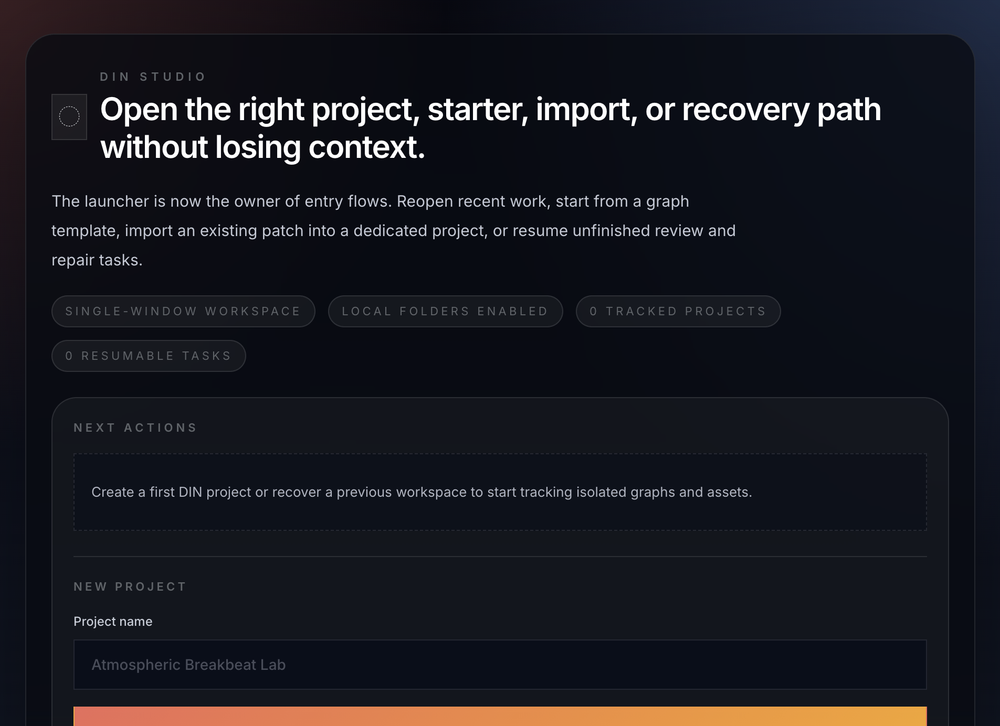

# First steps

*The launcher is the first screen: pick an entry path (recent work, template, import, recovery) or create a named project.*

## Launcher

When you start DIN Studio, you land on the **launcher**. From here you can:

- **Recent** — Search and reopen projects you worked on before.  
- **Templates** — Start from a prepared graph instead of an empty canvas.  
- **Import** — Bring existing work into a project as you enter the workspace.  
- **Recover** — Resume interrupted steps (for example repair or import) with a clear summary of what was left unfinished.

Pick a project to open; the **editor shell** loads with your graph workspace.

## Editor identity

The **title bar** and **top bar** show which project and graph you are editing. Theme and light global actions also live in the top bar.

## If you are new

1. Open or create a project from the launcher.  
2. Read the [interface tour](./interface-tour.md).  
3. Add a few nodes from the **Catalog** and connect them following [Building graphs](./building-graphs.md).  
4. Open the [Sources](./nodes/sources.md) and [Routing](./nodes/routing.md) guides to place **Transport**, sound sources, and **Output**.

---

[← User guide](./README.md) · [Interface tour →](./interface-tour.md)
