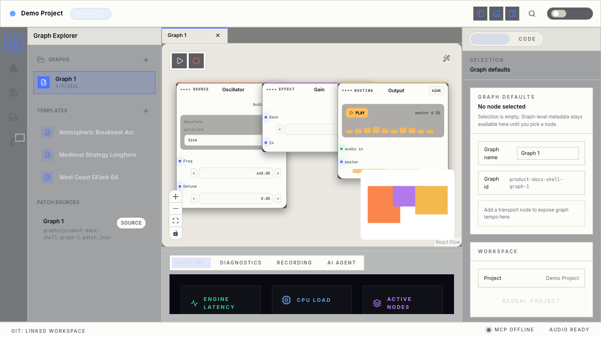
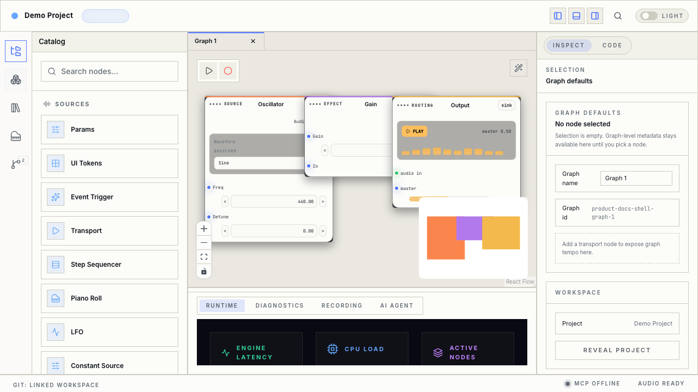
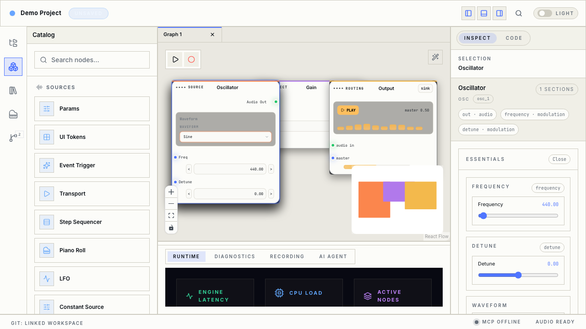
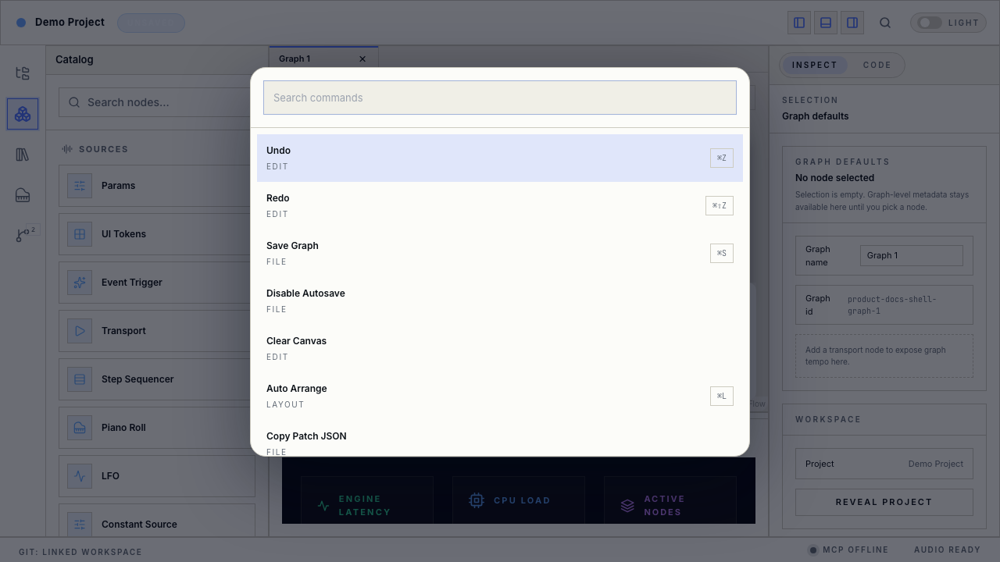

# Interface tour

The Phase 3A layout keeps one main task in focus: **editing the graph**. Surroundings stay stable so you do not have to relearn where things are.

*Main workspace after opening a project. **Left**: rail + browse drawer. **Center**: graph tabs, transport strip, canvas. **Right**: inspector (Inspect / Code). **Bottom**: runtime drawer. **Footer**: quiet status.*

## Regions at a glance

| Region | Role |
|--------|------|
| **Title bar** | Window and active graph identity. |
| **Top bar** | Light project context, command entry, theme, and outcome hints after major actions. |
| **Activity rail** (left edge) | Switches the **left drawer** between Explorer, Catalog, Library, Runtime, and Review modes. |
| **Browse drawer** | Shows **one** of: Graph Explorer, node Catalog, or Audio Library. Only one left-side browser at a time. |
| **Canvas** (center) | Graph tabs, transport strip, zoom and pan, nodes and cables, minimap. The **bottom drawer** sits under the canvas. |
| **Inspector** (right) | **Inspect** (parameters for the selection) and **Code** (generated output). When nothing is selected, **graph defaults** appear. |
| **Footer** | Quiet telemetry (for example branch name, connectivity hints, audio status)—not the main place to publish or review. |

## Left rail modes

- **Explorer** — Switch graphs, open templates, navigate project structure.  
- **Catalog** — Find nodes by category, search, **drag onto the canvas** or use add-to-graph flows. Categories match the node guides (Sources, MIDI, Effects, Routing, Math).  
- **Library** — Manage **audio files** used by Samplers and Convolvers (upload, preview, search, delete).  

*Catalog mode: search nodes and open a category (Sources, MIDI, Effects, Routing, Math) before dragging a node to the canvas.*

## Right inspector

- **Inspect** — Primary view when a node is selected. Detailed parameters live here so the node stays compact on the canvas.  
- **Code** — Read-only generated code for the current graph; updates as you edit.  
- With **no node selected**, use the empty state to adjust **graph-level** settings (such as name and defaults).

*Selecting a node on the canvas fills the inspector with that node’s parameters; use **Code** to see generated output.*

## Command palette

Press **Cmd+K** (macOS) or **Ctrl+K** (Windows/Linux) to open a **searchable list** of editor commands (layout, view, graph utilities). Choose a command by typing part of its name. **Escape** closes the palette.

## Bottom drawer (under the canvas)

Tabs commonly include **Runtime**, **Diagnostics**, **Recording**, and **AI Agent**—see [Recording, runtime, AI, and MIDI](./recording-runtime-ai-midi.md). You can resize the drawer so it does not hide the canvas on large screens.

## Review mode

**Publish** and **commit** work use a dedicated **Review** rail mode and **Source Control** surface—not the footer. See [Review and publish](./review-and-publish.md).

---

[← User guide](./README.md) · [Building graphs →](./building-graphs.md)
